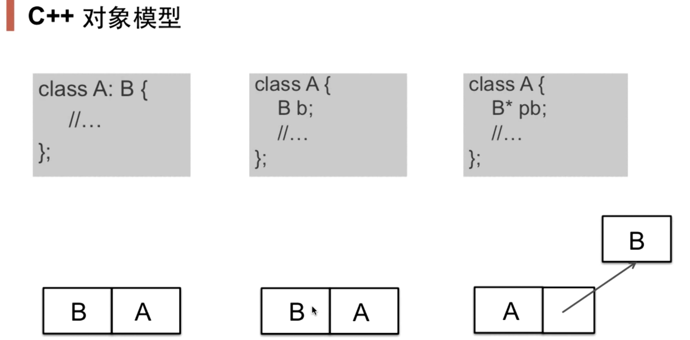
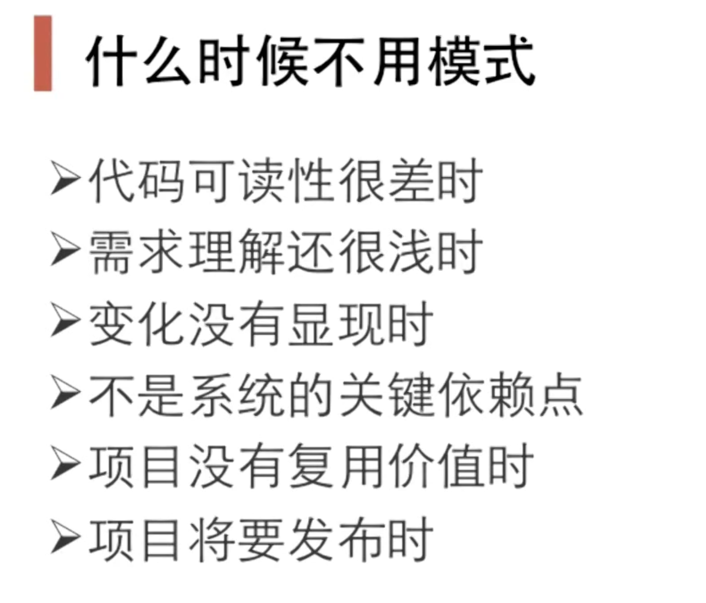
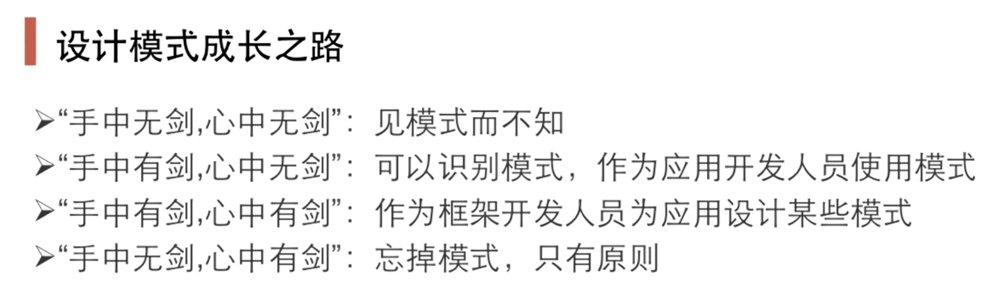

<center> <font face=red size=5> C++设计模式概要</font> </center>

[TOC]

&emsp;本文记录C++常见设计模式的一些总结, 按照使用场景对各个模式进行分类处理, 以便于后续假如改了太久BUG而没有写需求, 把各个设计模式的特点给忘了，那么看这篇文章就行快速唤醒设计模式相关的记忆。

&emsp;本文为学习博览李建忠老师的 **C++设计模式**课程后进行的总结, 在此向李老师表示深深的感谢。

#### 一 、组件协作类型
&emsp;现代软件都是使用模块化的开发, 所以各个模块之间会相互调用算法进行数据处理和通知。组件协作类型 //就是实现需要进行数据交互处理模块之间的松耦合 
主要是以松耦合的方式实现各个模块之间的数据交互处理或者消息传递。
, 主要方法是从编译时绑定调整为运行时绑定, 由静态调整为动态的。这种类型主要由三种设计模式: **①template模式**, **②strategy策略模式**，**③obeserver观察者模式**。 下面分别来详细说说。

##### 1.1 、template模式
&emsp; 软件开发中存在某项任务有相对稳定的执行流程, 但是这个流程中的部分子步骤存在不确定性或者变化较多。 比如查找文档中的特定字符串，从字符串中查找特定字符的算法应该是相对不变的，但是文档的格式存在不确定性。
&emsp; template模式允许整体流程结构不变的情况下，来灵活应对子步骤的变换或者晚绑定。
```javascript 
struct CMXParaseLib
{
    void Step1 ();
    void Step2 ();
    void Step3 ();
    void Run()
    {
        Step1(); Step2(); Step3(); Step4();
    }

    virtual void Step4 () = 0;
    virtual ~CMXParaseLib() = default;
}


struct CMXApp:public CMXParaseLib
{
   void Step4 () final;
}

int main()
{
    CMXParaseLib* lib = new CMXApp;
    lib->Run();

    //否则就是
    //CMXParaseLib lib
    //lib.Step1();
    //lib.Step2(); 
    //lib.Step3();
    //CMXApp app;
    //app.Step4();

    return 0;
}
```

##### 1.2 strategy策略模式
&emsp;strategy策略模式主要是解决代码中存在的一连串违背了开闭原则的if_else 代码。开闭原则的讲要对扩展开放，对更改封闭。**即尽量用扩展的方式来应该变换，不要直接在代码中使用增加if_else逻辑, 这样就可以在运行时动态的切换具体的算法**。 
&emsp;比如讲音视频中的解码可以使用 libVLC, ffmpeg, libmpv等库，在应用模块不应该直接使用 if_else 来加上每个库的解码流程，而应该抽象出一个基类，每当需要增加解码库类型时就从基类中派生出一个具体的类，这个就叫扩展，应用模块始终使用的都是一个解码抽象基类的句柄，所以不需要修改。需要用到具体的解码类型时，使用解码工厂类创建对应类实例，然后注册到应用模块即可。**strategy策略模式通常和Factory工厂模式一起使用**。

##### 1.3 obeserver观察者模式
&emsp; obeserver观察者模式的核心是通知(**Notify**), 实现类对象之间的通信。它主要解决违背了依赖倒置原则的代码, 即高层模块不应该依赖底层模块，两者都应该依赖抽象，抽象也不应该依赖实现细节。
&emsp;举例来讲，GUI APP需要获取一个视频转码的模块的转码进度，一种作做法就是视频转码模块直接包含GUI中对应控件的头文件定义，这显著违背了 DIP 原则。GUI APP是高层模块，转码库是底层模块，两者之间不应该出现任何的直接依赖。
&emsp;正确的做法是**抽象出一个需要获取通知的接口基类**，GUI中对应控件继承这个接口成为一种具体的被通知的类型，转码模块只依赖这个接口基类即可。
&emsp;通常情况下发起通知的模块内包含一个接口基类的数组指针，并且提供 **RegisterNotify() 和 RemoveNotify** 两个函数，以达到通知多个实例的目的。

#### 二 、单一责任类型
&emsp;这个类型包含两种设计模式**装饰模式和桥模式**

##### 2.1 装饰模式
&emsp; 装饰模式主要是解决过度的使用继承来扩展类的功能，直接在派生类的基础上再派生新的功能类, 这是一种静态扩展的模式，一方面缺乏灵活性，另外会出现大量重复的代码。 装饰模式使用组合替换继承的方式来实现一方面扩展功能，一方面避免派生类的急剧膨胀。
&emsp; 考虑如下代码，假如需要对不同类型的数据流实现加解密和缓存操作。
```javascript 
class Stream{
public：
    virtual char Read(int number)=0;
    virtual void Seek(int position)=0;
    virtual void Write(char data)=0;
    
    virtual ~Stream(){}
};
```
数据流可能是文件流，内存流或者网络流，所以从 **Stream** 分别派生出不同的子类是正确的。

```javascript
class FileStream: public Stream{
};
class NetworkStream:public Stream{
};
class MemoryStream:public Stream{
};
```
这个时候的继承关系满足 **is-a** 的关系, C++ 鼓励使用这种关系的继承。假如这个时候新增对数据流进行加密的需求，该咋个实现呢? 直接在各个具体数据流的基础上再继续派生新的类？
```javascript
class CryptoFileStream :public FileStream{
}
```
不对，此时的继承不满足 **is-a**的关系，加密文件流不是文件流的一种，所以要使用组合来替换继承。
```javascript
class CryptoStream: public Stream {
    Stream* stream;
public:
    CryptoStream(Stream* stm):stream(stm){
    }
    //
};

class BufferedStream : public Stream{
    Stream* stream;
public:
    BufferedStream(Stream* stm):stream(stm){   
    }
};
```
按道理，假如只是操作一种数据流的话，具体的操作类不应该继承 **Stream** 抽象基类才对，直接组合一个多态基类指针成员变量就可以了。但是这就不能很好的解决复合操作，比如对文件流先加密再缓存, 装饰模式就是在解决在一种操作的基础上再进行其他的操作。完整的代码如下:
```javascript 
class Stream{
public：
    virtual char Read(int number)=0;
    virtual void Seek(int position)=0;
    virtual void Write(char data)=0;
    
    virtual ~Stream(){}
};
class FileStream: public Stream{
};
class NetworkStream:public Stream{
};
class MemoryStream:public Stream{
};

DecoratorStream: public Stream{
protected:
    Stream* stream;
    DecoratorStream(Stream * stm):stream(stm){
    }
};

class CryptoStream: public DecoratorStream {
public:
    CryptoStream(Stream* stm):DecoratorStream(stm){
    } 
    virtual char Read(int number){ 
        stream->Read(number);/
    }

    virtual void Seek(int position){  
        stream::Seek(position);
    }

    virtual void Write(byte data){
        stream::Write(data);       
    }
};

class BufferedStream : public DecoratorStream{
    
    Stream* stream;//...
    
public:
    BufferedStream(Stream* stm):DecoratorStream(stm){       
    }

};

void Process(){
    //运行时装配
    FileStream* s1=new FileStream();
    CryptoStream* s2=new CryptoStream(s1);
    BufferedStream* s3=new BufferedStream(s1);

    //缓存的基础上再缓存
    BufferedStream* s4=new BufferedStream(s2);
}
```
总结：装饰模式感觉不是解决多重继承问题，而是解决主体继承类在多个功能方向上的扩展之后再任意组合问题。在具体功能扩展体系的接口上，Decorator的派生类是 **is-a**的关系，但是功能上又是 **has-a** 的关系。这个是它的特点了。

##### 2.2 桥模式
&emsp;桥模式与装饰模式是相似的，不同的地方是它没有功能上的任意组合关系。桥模式把抽象和实现分开成两个独立的接口基类，各自沿着各自的方向派生具体的子类。当一个变化方向需要用到另外一个方向上的功能时，在内部组合一个该方向的接口指针。示例代码如下:
```javascript 
class Implementor
{
public:
  virtual ~Implementor() {}
  virtual void action() = 0;
};

class ConcreteImplementorA : public Implementor
{
public:
  ~ConcreteImplementorA() {}
  void action() {}
};

class ConcreteImplementorB : public Implementor
{
public:
  ~ConcreteImplementorB() {}
  void action() {}
};

class Abstraction
{
public:
  virtual ~Abstraction() {}
  virtual void operation() = 0;
};

class RefinedAbstraction : public Abstraction
{
public:
  ~RefinedAbstraction() {}
  RefinedAbstraction(Implementor *impl) : implementor(impl) {}
  
  void operation()
  {
    implementor->action();
  }
private:
  Implementor* implementor;
};

int main()
{
  Implementor *ia = new ConcreteImplementorA;
  Implementor *ib = new ConcreteImplementorB;
  
  Abstraction *abstract1 = new RefinedAbstraction(ia);
  abstract1->operation();
  Abstraction *abstract2 = new RefinedAbstraction(ib);
  abstract2->operation();
  
  delete abstract1;
  delete abstract2;
  delete ia;
  delete ib;

  return 0;
}
```
&emsp;如上所示，桥模式就是把多个不同变换维度的派生类通过基类指针的方式组合在一起。而不是使用多继承，多继承违背了单一职责原则，李建忠老师指出不推荐这种方式。
&emsp;示例代码中还有一个问题是 **Abstraction**的派生类中都会存在一个 **Implementor**的指针，更完美的方式是把这个派生类中相同的成员变量放到基类  **Abstraction** 中去。


#### 三 、对象创建类型
&emsp; 这组类型主要解决不同模块之间创建对象时紧耦合的问题。
##### 3.1 工厂模式
&emsp;软件系统经常面临创建对象的情况，因为需求的变化，通常需要创建对象的具体类型也会面临变化，比如人脸检测方案，某些场合可能需要使用 OpenCV+DNN 来实现，某些场则需要使用 Dlib 库。但是应用层传递帧数据和检测结果的接口通常是一致的。假如UI层直接 通过 **new** 来创建具体的类型，实现细节只要一变，要改的地方就很，而且违背了**依赖倒置原则**。 
&emsp;这就是工厂模式要解决的问题，定义一个创建对象的接口，让派生类在运行时决定创建具体的类型，使得一个类的实例化得到延迟而非直接更改(**UI层的代码不变，在运行时指定工厂接口即可**)，而且后续方便扩展新的具体类型。 这样依赖就解决了诸如 UI 层模块在编译时直接显示依赖具体类型问题，实现了解耦。
&emsp;当然，工厂模式要求创建对象的方法和方法参数都得完全相同。

##### 3.2 抽象工厂模式
&emsp;工厂模式解决了创建对象在编译时直接依赖的问题，当一个模块中的对象只需依赖另外一个模块中的一种或者几种不相关的的对象时，工厂模式就够用了。但是当需要依赖其他模块中的一系列相关对象时，工厂模式就不够完美了。比如数据库有连接和访问两种操作，针对不同的数据库分别派生出具体的操作类，代码如下:
```javascript
// abstract Connect and factoty
class IDBConnection{};
class IDBConnectionFactory{
public:
    virtual IDBConnection* CreateDBConnection()=0;
};

class SqlConnection: public IDBConnection{};
class SqlConnectionFactory:public IDBConnectionFactory{};

**********************************

// abstract Read and factoty
class IDataReader{ };
class IDataReaderFactory{
public:
    virtual IDataReader* CreateDataReader()=0;
};

class SqlDataReader: public IDataReader{};
class SqlDataReaderFactory:public IDataReaderFactory{};

//user 
class User
{
private:
    IDBConnectionFactory* dbConnectionFactory;
    IDataReaderFactory*   dataReaderFactory;
}
```
这种时候就有隐患，假如 User 被注册的连接器工厂是SQL的，但是访问工厂却是Oracle的，两者不兼容，这个时候就要出问题了。所以相关的实例最好通过一个工厂创建出来，抽象工厂就是来解决工厂模式这个问题的。
```javascript
class IDBFactory{
public:
    virtual IDBConnection* CreateDBConnection() =0;
    virtual IDataReader* CreateDataReader()     =0;   
};


class SqlConnection: public IDBConnection{};
class SqlCommand: public IDBCommand{};
class SqlDataReader: public IDataReader{};

class SqlDBFactory:public IDBFactory{
public:
     IDBConnection* CreateDBConnection() override;
     IDBCommand* CreateDBCommand()       override;
     IDataReader* CreateDataReader()     override;
};
```
&emsp;抽象工厂就是把一组相关联的接口从各自独立的工厂聚合到一个工厂里面，这样就保证了它们的一致性。李建忠老师说这个应该叫 **Family Factory Medthod**。

##### 3.3 原型模式
&emsp;通过工厂模式和抽象工厂模式创建的对象都属于执行完默认构造或者有参构造的初始化对象。假如一个类的结构比较复杂，尤其是当这个类被创建出来被使用一段时间后，内部的各种参数标识着各种状态。比如非编时间线上编辑了一段文本，在另外一个时码处也需要用到这个文本对象，这个时候通过工厂创建出一个初始化的文本对象，再把前一个文本对象的参数赋值一次，就显得有点复杂了。假如能提供一个接口直接拷贝一个较为复杂的对象就好了，这就是原型模式要解决的问题。**它在基类中声明一个 Clone 接口，与此同时派生类需要保证一个正确的拷贝构造函数**。代码实例如下:
```javascript
class ISplitter{
public:
    virtual void split()=0;
    virtual ISplitter* clone()=0; //通过克隆自己来创建对象   
    virtual ~ISplitter(){}
};

class TxtSplitter: public ISplitter{
public:
    virtual ISplitter* clone(){
        return new TxtSplitter(*this);
    }
};
class BinarySplitter : public ISplitter{
public:
    virtual ISplitter* clone(){
        return new BinarySplitter(*this);
    }
};
```
##### 3.4 Builder模式
&emsp;这个模式感觉和模板方法模式很像。主要用于分步骤创建一个复杂的对象，这个步骤通常是相对稳定的，而创建的过程相对变换频繁。假如这个创建过程需要使用到非常多的步骤，那么可以把这些步骤抽象出来成为一个单独的类，再在这个类里面注册需要创建类的初始指针，步骤执行完毕再返回创建类的指针回去即可。

#### 四 、对象性能模式
##### 4.1单例模式
&emsp;这个模式通常用在整个系统中只需要一个类的实例的情况, 不应该由调用者来确保只实例化一个类的对象，应该由类的设计者来保证。 这里直接贴出一个 C++11 版本的线程安全的单例模式示例。
```javascript
std::atomic<Singleton*> Singleton::m_instance;
std::mutex Singleton::m_mutex;

Singleton* Singleton::getInstance() {
    Singleton* tmp = m_instance.load(std::memory_order_relaxed);
    std::atomic_thread_fence(std::memory_order_acquire);
    if (tmp == nullptr) {
        std::lock_guard<std::mutex> lock(m_mutex);
        tmp = m_instance.load(std::memory_order_relaxed);
        if (tmp == nullptr) {
            tmp = new Singleton;
            std::atomic_thread_fence(std::memory_order_release);
            m_instance.store(tmp, std::memory_order_relaxed);
        }
    }
    return tmp;
}
```
##### 4.2 享元模式
&emsp;这个设计模式主要用来解决系统中存在大量零散对象的问题，通常伴随的问题是占用很高的系统内存，所以需要运用共享技术有效的支持大量细粒度的对象。比如线程池就是一个类似的例子, 线程对象的创建开销就比较大，所以提前创建一定数量的线程挂起来，让不同业务共享使用。这里给出一个字体相关的例子，比如一个上万字的文档，通常不会每个字符都单独有一个字体，所以相同字体的字符可以共享一个字体实例，在渲染的时候直接查找相关字体实例进行渲染即可。
```javascript
class Font {
private:

    //unique object key
    string key;
    
    //object state
    //....
    
public:
    Font(const string& key){
       
    }
};


class FontFactory{
private:
    map<string,Font* > fontPool;
    
public:
    Font* GetFont(const string& key){
        map<string,Font*>::iterator item=fontPool.find(key);
        
        if(item!=footPool.end()){
            return fontPool[key];
        }
        else{
            Font* font = new Font(key);
            fontPool[key]= font;
            return font;
        }
    }
};
```

#### 五 、接口隔离模式
&emsp; 组件构建过程中，经常会面临接口之间直接依赖时的不方便，或者无法实现。 所有需要采用间接的接口来隔离那些不方便直接依赖的接口，双方都通过间接接口来实现数据的交互。
##### 5.1 、Facade门面模式 
&emsp;Facade 模式是把一系列相关的组件整合起来，这一系列组件不单独对外提供接口，而是把相关功能整合到 Facade 类里面去，用户模块只调用 Facade的接口，从而达到调用一系列组件的目的。
这样一来，即使组件之间的相互依赖发生变化后，用户模块不用重编译，达到了一种解耦的目的。
&emsp; 举个例子来讲，比如时间线上或者预览窗口中剪辑视频素材或者物件。此时，时间线或者预览窗口模块直接操作素材句柄或者物件句柄的方式就不太好，这样会让界面模块大量充斥着具体素材或者物件逻辑相关的代码。
合理的选择是提供一个 **CGEditorFacade**的门面类，界面将需要编辑的物件句柄注册到门面类，通过这个 **Facade** 类来提供操作的具体实现，比如物件属性的拷贝，物件拆分的等等逻辑代码。

##### 5.2 、Proxy代理模式
&emsp; Proxy 模式和 Facade门面模式 很相似，都是一个模块直接调用另外一个模块接口操作时不方便而引出的。核心就是对需要操作的对象提供一层代理，代理的接口和对象句柄的接口尽可能的保持一致。如下所示:
```javascript
class ISubject{
public:
    virtual void process();
};

class SubjectProxy: public ISubject{
public:
    virtual void process(){
        //对Subject的一种间接访问
    }
};

class ClientApp{   
    ISubject* subject;  
public:
    
    ClientApp(){
        subject=new SubjectProxy();
    }
 
    void DoTask(){
        subject->process();     
    }
};
```
具个例子来讲，假如视频渲染的坐标系和某些特技的坐标系可能不一致，或者某些像素格式需要进行转换。这个时候增加一个代理类来在实际渲染前进行数据的预处理就比较合适。

##### 5.3 、Adapter适配模式
&emsp;适配模式主要是用于将旧接口组合到新的接口里面使用，通常解决的问题是旧接口无法直接满足新环境的要求，也就是复用遗留的代码或者叫迁移旧的类库。适配模式通常有对象适配和类适配两种方式。
对象适配示例如下:

```javascript
//目标接口（新接口）
class ITarget{
public:
    virtual void process()=0;
};

//遗留接口（老接口）
class IAdaptee{
public:
    virtual void foo(int data)=0;
    virtual int bar()=0;
};

//遗留类型
class OldClass: public IAdaptee{
    //....
};

//对象适配器
class Adapter: public ITarget{ //继承
protected:
    IAdaptee* pAdaptee;//组合 
public:
    
    Adapter(IAdaptee* pAdaptee){
        this->pAdaptee=pAdaptee;
    }
    
    virtual void process(){
        int data=pAdaptee->bar();
        pAdaptee->foo(data);       
    }
  
};

int main(){
    IAdaptee* pAdaptee=new OldClass();
    ITarget* pTarget=new Adapter(pAdaptee);
    pTarget->process();
}
```

其中类适配的示例如下:
```javascript
//类适配器
class Adapter: public ITarget,
               protected OldClass{ //多继承                    
}
```
类适配模式需要继承老接口或者对应的实例。假如继承老接口，因为是接口类，继承它不能获得相应的数据处理成员函数。假如私有继承旧代码类的实例，耦合性又太强了，只能使用 **OldClass** 这一种实例类型对应的数据处理方法。
**所以适配模式适合使用对象适配的方式，松耦合，Adapter内组合一个老接口类的指针，可以根据需要调用不同的实例方法**。

##### 5.4 、中介者模式
&emsp;中介者模式与Facade门面模式相似， 门面模式是解决一个模块与另外一个模块内的组件之间的隔离， 而中介者是解决一个模块中出现了很多个组件相互依赖的情况。当一个模块内有很多个对象相互依赖时，创建一个中介者来与每个对象进行相互依赖，原本很多个对象之间的直接消息交互都通过中介者来进行。
当然，与此同时需要定义一套消息标准，以确保中介者把传递给正确的对象。 这个有点像Qt里面的信号槽框架，额外就是加了观察者模式。


#### 六 、状态模式
##### 6.1 、state模式
&emsp; state模式 和 strategy策略模式很相似，即枚举类型对应产生了大量的 if_else逻辑代码。每一个数据操作方法里面都需要使用 if_else 来判断枚举中的各个状态，并且伴随着状态的切换，这个时候每增加一种状态，每一个对应的方法都需要增加一个  if_else.
合理的优化就是针对状态来抽象各个方法。
```javascript
enum NetworkState
{
    Network_Open,
    Network_Close,
    Network_Connect,
};

class NetworkProcessor{
    NetworkState state;
public:
    
    void Operation1(){
        if (state == Network_Open){

            //**********
            state = Network_Close;
        }
        else if (state == Network_Close){

            //..........
            state = Network_Connect;
        }
        else if (state == Network_Connect){

            //$$$$$$$$$$
            state = Network_Open;
        }
    }

    public void Operation2(){

        if (state == Network_Open){
            
            //**********
            state = Network_Connect;
        }
        else if (state == Network_Close){

            //.....
            state = Network_Open;
        }
        else if (state == Network_Connect){

            //$$$$$$$$$$
            state = Network_Close;
        }
    
    }
};
```
如上所示，两个 **Operation** 方法里面都需要 通过if_else来判断状态，也就是在具体方法里面来通过 if_else 处理并切换状态，这样每个方法和枚举状态类型之间是紧耦合的。
```javascript
class NetworkState{
public:
    NetworkState* pNext;
    virtual void Operation1()=0;
    virtual void Operation2()=0;
    virtual void Operation3()=0;
    virtual ~NetworkState(){}
};

class OpenState :public NetworkState{
    static NetworkState* m_instance;
public:
    static NetworkState* getInstance(){
        if (m_instance == nullptr) {
            m_instance = new OpenState();
        }
        return m_instance;
    }

    void Operation1(){
        
        //**********
        pNext = CloseState::getInstance();
    }
    
    void Operation2(){
        
        //..........
        pNext = ConnectState::getInstance();
    }
    
    void Operation3(){
        
        //$$$$$$$$$$
        pNext = OpenState::getInstance();
    }
    
    
};

class CloseState:public NetworkState{ }

class NetworkProcessor{
    
    NetworkState* pState;
    
public:
    
    NetworkProcessor(NetworkState* pState){
        
        this->pState = pState;
    }
    
    void Operation1(){
        pState->Operation1();
        pState = pState->pNext;
    }
    
    void Operation2(){
        pState->Operation2();
        pState = pState->pNext;
    }
};
```
如上所示，合理的选择是将每个特定状态对应的 **Operation** 抽象出来放在 **state**子类里面，当前状态的下的操作处理完需要状态切换时，切换对应的 **state**句柄就可以了。
这个模式感觉和 **strategy策略模式** 模式相比，应该就是多了一个状态的切换，所以就叫 **state状态模式**, 哈哈哈。 

##### 6.2 、Memento备忘录模式
&emsp;备忘录模式解决的问题是在保护一个对象实现细节的前提下，保存某一时刻的状态来用于将来恢复， 所以就叫备忘录模式。示例代码如下:
```javascript
 class Memento
{
    string state;
public:
    Memento(const string & s) : state(s) {}
    string getState() const { return state; }
    void setState(const string & s) { state = s; }
};

class Originator
{
    string state;
public:
    Originator() {}
    Memento createMomento() {
        Memento m(state);
        return m;
    }
    void setMomento(const Memento & m) {
        state = m.getState();
    }
};

int main()
{
    Originator orginator;
    
    //捕获对象状态，存储到备忘录
    Memento mem = orginator.createMomento();
    
    //... 改变orginator状态

    //从备忘录中恢复
    orginator.setMomento(memento);
}   
```
如上所示，**Originator**类中有个 **std::string** 类型的 state, 某一时刻假如想保存这个状态，直接的办法就是提供一个 **public**成员函数来返回这个 state(**需要深拷贝**).但是这种做法暴露了
**Originator**类中有 **std::string**实现细节，所有需要借助 **Memento** 来分装一层。这个模式采用这个这种方式的目前我见得不多，几乎都是直接使用**内存序列化和反序列化**来保存和恢复一个类的状态，或者使用其他的编码方式，毕竟正常情况下一个类内部的结构不比较复杂。

#### 七 、数据结构模式
>这个模块的模式作用主要就是向用户隐藏对象中的数据结构细节。

##### 7.1 、Composite组合模式
&emsp;这个模式的定义是将对象组合成树形结构，以表示**部分-整体**的层次结构。这样就使得用户对单个对象和组合对象的调用具有一致性。只要用户拿到 **root**对象后, 调用统一的接口, 然后 **root**对象内部去依次遍历调用每个对象的该方法。
示例代码如下：
```javascript
class Component
{
public:
    virtual void process() = 0;
    virtual ~Component(){}
};

//树节点
class Composite : public Component{
    
    string name;
    list<Component*> elements;
public:
    Composite(const string & s) : name(s) {}
    
    void add(Component* element) {
        elements.push_back(element);
    }
    void remove(Component* element){
        elements.remove(element);
    }
    
    void process(){
        //1. process current self node
    
        //2. process leaf nodes
        for (auto &e : elements)
            e->process(); //多态调用      
    }
};

//叶子节点
class Leaf : public Component{
    string name;
public:
    Leaf(string s) : name(s) {}
            
    void process(){
        //process current node
    }
};

//假如不使用 Composite模式, 用户Invoke调用就自己去挨个遍历
void Invoke(Component & c){
    //...
    c.process();
    //...
}

int main()
{
    Composite root("root");
    Composite treeNode1("treeNode1");
    Composite treeNode2("treeNode2");
    Composite treeNode3("treeNode3");
    Composite treeNode4("treeNode4");
    Leaf leat1("left1");
    Leaf leat2("left2");
    
    root.add(&treeNode1);
    treeNode1.add(&treeNode2);
    treeNode2.add(&leaf1);
    
    root.add(&treeNode3);
    treeNode3.add(&treeNode4);
    treeNode4.add(&leaf2);
    
    process(root);
    process(leaf2);
    process(treeNode3);
}
```
我感觉这个模式是**观察者模式与装饰模式**的结合体, 目前好像还没见过这个模式，使用场景似乎应该就是需要一次性调用多个对象的时候，目前在工作中都是使用标准库的容器直接来存多个对象，然后自己遍历，这个模式确实提供了一种思路。
李建忠老师说 **add/remove** 不应该放到接口类里面，但是放到具体的子类里面会出现紧耦合。这个模式应该就是使用了递归的思想，叶节点**Leaf**就是递归结束的条件。

##### 7.2 、Iterator迭代器模式
&emsp; 这个模式和C++标准库的迭代器很相似，像标准库那样充当 容器和算法之间链接的桥梁。 使用对象的方式来实现的示例如下:
```javascript
template<typename T>
class Iterator
{
public:
    virtual void first() = 0;
    virtual void next() = 0;
    virtual bool isDone() const = 0;
    virtual T& current() = 0;
};

template<typename T>
class MyCollection{
    
public:
    
    Iterator<T> GetIterator(){
        //...
    }
    
};

template<typename T>
class CollectionIterator : public Iterator<T>{
    MyCollection<T> mc;
public:
    
    CollectionIterator(const MyCollection<T> & c): mc(c){ }
    
    void first() override {
        
    }
    void next() override {
        
    }
    bool isDone() const override{
        
    }
    T& current() override{
        
    }
};

void MyAlgorithm()
{
    MyCollection<int> mc;
    
    Iterator<int> iter= mc.GetIterator();
    
    for (iter.first(); !iter.isDone(); iter.next()){
        cout << iter.current() << endl;
    }
}  
```
这种多态的迭代器模式与标准库的泛型模板相比，性能就会差一些。一个是编译时多态，一个是运行时多态，前者的性能要高于后者。泛型模板的多态实现可以参考侯捷老师的**STL源码剖析**一书。

##### 7.3 、职责链模式
&emsp;这个模式主要解决一个请求可能被多个对象处理，但是每个请求在运行时只能有一个接受者，如果显示指定，将必不可少地带来请求发送者与接收者出现紧耦合的问题。所以需要使用**职责链模式**是的每个对象都有机会处理请求，从而避免请求的发送者与接受者之间的耦合关系。
实现细节是将接受者对象连成一条链条，并沿着这条链传递请求，指导有一个对象处理它为止。示例代码如下:
```javascript
enum class RequestType
{
    REQ_HANDLER1,
    REQ_HANDLER2,
    REQ_HANDLER3
};

class Reqest
{
    string description;
    RequestType reqType;
public:
    Reqest(const string & desc, RequestType type) : description(desc), reqType(type) {}
    RequestType getReqType() const { return reqType; }
    const string& getDescription() const { return description; }
};

class ChainHandler{
    
    ChainHandler *nextChain;
    void sendReqestToNextHandler(const Reqest & req)
    {
        if (nextChain != nullptr)
            nextChain->handle(req);
    }
protected:
    virtual bool canHandleRequest(const Reqest & req) = 0;
    virtual void processRequest(const Reqest & req) = 0;
public:
    ChainHandler() { nextChain = nullptr; }
    void setNextChain(ChainHandler *next) { nextChain = next; }
    
   
    void handle(const Reqest & req)
    {
        if (canHandleRequest(req))
            processRequest(req);
        else
            sendReqestToNextHandler(req);
    }
};


class Handler1 : public ChainHandler{
protected:
    bool canHandleRequest(const Reqest & req) override
    {
        return req.getReqType() == RequestType::REQ_HANDLER1;
    }
    void processRequest(const Reqest & req) override
    {
        cout << "Handler1 is handle reqest: " << req.getDescription() << endl;
    }
};
        
class Handler2 : public ChainHandler{
protected:
    bool canHandleRequest(const Reqest & req) override
    {
        return req.getReqType() == RequestType::REQ_HANDLER2;
    }
    void processRequest(const Reqest & req) override
    {
        cout << "Handler2 is handle reqest: " << req.getDescription() << endl;
    }
};

class Handler3 : public ChainHandler{
protected:
    bool canHandleRequest(const Reqest & req) override
    {
        return req.getReqType() == RequestType::REQ_HANDLER3;
    }
    void processRequest(const Reqest & req) override
    {
        cout << "Handler3 is handle reqest: " << req.getDescription() << endl;
    }
};

int main(){
    Handler1 h1;
    Handler2 h2;
    Handler3 h3;
    h1.setNextChain(&h2);
    h2.setNextChain(&h3);
    
    Reqest req("process task ... ", RequestType::REQ_HANDLER3);
    h1.handle(req);
    return 0;
}
```
实际代码中还有较多细节要处理。比如三个接受者都不可以处理任务的时候，怎么处理这个请求，需要有一个缺省机制。这个模式好处是将所有的接受处理器形成一个链表结构，用户只需要拿到一个 **HEAD**接受者即可， 由接受者模块来指定实际对应的处理器。
怎么又有感觉这个模式和工厂模式有点像了。

#### 八 、行为变化模式

>这个模式是将组件的行为和组件本身进行解耦，从而支持组件行为的变化。我理解就用户端拿到组件对象或者对象接口句柄后不直接通过对象调用接口的方法，而是把接口句柄放在一个对象里面。
##### 8.1 、Command模式
&emsp;在软件构建中，行为的请求者与实现通常呈现一种紧耦合。但是在某些场合，比如需要对行为进行记录，典型场景就是 **undo/redo** 处理。这个紧耦合不是编译时的那种紧耦合，而是逻辑上的紧耦合，似乎有点像门面模式。所以需要一种模式来实现逻辑上的松耦合。
将请求封装为一个对象，从而使得可以用不同的请求句柄对客户进行参数化。对请求排队或者记录请求，以及支持可撤销操作。

示例代码如下:
```javascript
class Command
{
public:
    virtual void execute() = 0;
};

class ConcreteCommand1 : public Command
{
    string arg;
public:
    ConcreteCommand1(const string & a) : arg(a) {}
    void execute() override
    {
        cout<< "#1 process..."<<arg<<endl;
    }
};

class ConcreteCommand2 : public Command
{
    string arg;
public:
    ConcreteCommand2(const string & a) : arg(a) {}
    void execute() override
    {
        cout<< "#2 process..."<<arg<<endl;
    }
};
          
class MacroCommand : public Command
{
    vector<Command*> commands;
public:
    void addCommand(Command *c) { commands.push_back(c); }
    void execute() override
    {
        for (auto &c : commands)
        {
            c->execute();
        }
    }
};
             
int main()
{
    ConcreteCommand1 command1(receiver, "Arg ###");
    ConcreteCommand2 command2(receiver, "Arg $$$");
    
    MacroCommand macro;
    macro.addCommand(&command1);
    macro.addCommand(&command2);   
    macro.execute();
}
```
如上所示命令模式就是使用一个 **MacroCommand的复合命令**，把一系列命令组合起来。然后通过统一调用。注意 **Command接口应该满足返回值和入参都是 void**. 这个模式在编辑场景下感觉用的很多，比如通过多个鼠标点来拟合一个任意的多边形。
用户在设置某些点后中途可能会取消，这个时候就可以在 **复合命令MacroCommand**中取消那些点的绘制接口。再比如以前玩游戏里面通过操作指令来释放技能的逻辑也有这个模式的影子。
 考虑到Command接口入参和返回值都是void, 所以可以使用函数对象来实现，这个有性能优势，一方面是泛型的**编译时多态**，一方面函数对象可以被编译器进行 **inline**优化。

 ##### 8.2 、Visitor访问器模式
 &emsp;软件开发过程中，由于需求的变化，接口通常会面临新增接口的情况，假如这个接口是当前版本新增的还好，一旦针对某些已经发版了的接口去直接新增函数，通常就会比较麻烦。一方面接口类的所有派生类都需要覆写这个函数，
 另外就是所有依赖这个接口的模块全部需要重新编译，正常情况下是不敢这么大面积的给现场用户更新补丁的。示例代码如下:
```javascript

class Visitor;

class Element
{
public:
    virtual void accept(Visitor& visitor) = 0; //第一次多态辨析

    virtual ~Element(){}
};

class ElementA : public Element
{
public:
    void accept(Visitor &visitor) override {
        visitor.visitElementA(*this);
    }
};

class ElementB : public Element
{
public:
    void accept(Visitor &visitor) override {
        visitor.visitElementB(*this); //第二次多态辨析
    }
};

class Visitor{
public:
    virtual void visitElementA(ElementA& element) = 0;
    virtual void visitElementB(ElementB& element) = 0;
    
    virtual ~Visitor(){}
};

//==================================

//Visitor 扩展1
class Visitor1 : public Visitor{
public:
    //需要对 ElementA 类新增的操作
    void visitElementA(ElementA& element) override{
        cout << "Visitor1 is processing ElementA" << endl;
    }

    //需要对 ElementB 类新增的操作
    void visitElementB(ElementB& element) override{
        cout << "Visitor1 is processing ElementB" << endl;
    }
};
     
//Visitor 扩展2
class Visitor2 : public Visitor{
public:

    //需要再次对 ElementA 类新增的操作
    void visitElementA(ElementA& element) override{
        cout << "Visitor2 is processing ElementA" << endl;
    }

    //需要再次对 ElementB 类新增的操作
    void visitElementB(ElementB& element) override{
        cout << "Visitor2 is processing ElementB" << endl;
    }
};
            
int main()
{
    Visitor2 visitor;
    ElementB elementB;
    elementB.accept(visitor);// double dispatch
    
    ElementA elementA;
    elementA.accept(visitor);

    return 0;
}
```
注意这个 **Visitor**模式存在比较严格的要求。
> ① 首先处理具体业务的多态类层次结构中需要定义一个类似**accept**的方法，用来将来扩展类的函数方法。
> ② 业务类的层次结构要稳定，也就是 **element**的派生类的类型要稳定。一旦不稳定会导致 **Visitor**接口类也发生变化。
> ③ **Visitor**接口类需要保持稳定，而且里面需要针对 **element** 的每个派生类的增加一个接口，以便于后续每个派生类新增方法。所以**Visitor**接口里面是入参都是 **element**派生类的实例，这样才可以对其扩展方法。
> ④ **Visitor**的派生类在正对每个 **element**的实例增加函数方法的时候，这个函数的名字其实是固定的，**Visitor**接口已经确定了，所以准确的说扩展的方法其实就是 **Visitor** 派生类的名字。
> ⑤ 这个模式存在两次分发的流程，第一次是先确定哪个 **element** 的派生类需要扩展函数方法, 到底是 **ElementB** 还是**ElementA**需要扩展。第二次是确定扩展哪个方法，到底是  **Visitor1** 还是**Visitor2**。这两点都通过多态实例来实现。
这个模式还有一种比较流行的方法 **com**技术，比如 windows 平台的渲染API **directx**, 通过 **QueryInterface**来查询各个版本的新接口。 

 ##### 8.3 、Interpreter解析器模式
 &emsp;解析器这个模式的意义学习完了有点似懂非懂的感觉。根据李老师在课堂上讲述的示例，对于一个**a+b+c+d**这样的表达式，先抽象出一个表达式的接口类 **IExpresss**, 然后分别派生符号表达式类和值表达式类, 对于符号表达式需要进一步分别派生**+,-**两个示例。
 在解析一个给定的类似于**a+b+c+d**的字符串逻辑时, 使用类似节点的逻辑，从表达式的左边依次解析，使用栈来存储解析各个句柄。假如是符号表达式，则需要先取出栈顶，然后构建下一个节点的值表达式，最后构造出一个符号表达式放在栈顶。最后只需要返回栈顶的元素即可。
 最终在将各个符号替换成值后，进行计算时再依次遍历，整个过程有点类型于**递归与反向递归**。示例代码如下:
 ```javascript
 class Expression {
public:
    virtual int interpreter(map<char, int> var)=0;
    virtual ~Expression(){}
};

//变量表达式
class VarExpression: public Expression {
    
    char key;
    
public:
    VarExpression(const char& key)
    {
        this->key = key;
    }
    
    int interpreter(map<char, int> var) override {
        return var[key];
    }
    
};

//符号表达式
class SymbolExpression : public Expression {
    
    // 运算符左右两个参数
protected:
    Expression* left;
    Expression* right;
    
public:
    SymbolExpression( Expression* left,  Expression* right):
        left(left),right(right){
        
    }
    
};

//加法运算
class AddExpression : public SymbolExpression {
    
public:
    AddExpression(Expression* left, Expression* right):
        SymbolExpression(left,right){
        
    }
    int interpreter(map<char, int> var) override {
        return left->interpreter(var) + right->interpreter(var);
    }
    
};

//减法运算
class SubExpression : public SymbolExpression {
    
public:
    SubExpression(Expression* left, Expression* right):
        SymbolExpression(left,right){
        
    }
    int interpreter(map<char, int> var) override {
        return left->interpreter(var) - right->interpreter(var);
    }
    
};


Expression*  analyse(string expStr) {
    
    stack<Expression*> expStack;
    Expression* left = nullptr;
    Expression* right = nullptr;
    for(int i=0; i<expStr.size(); i++)
    {
        switch(expStr[i])
        {
            case '+':
                // 加法运算
                left = expStack.top();
                right = new VarExpression(expStr[++i]);
                expStack.push(new AddExpression(left, right));
                break;
            case '-':
                // 减法运算
                left = expStack.top();
                right = new VarExpression(expStr[++i]);
                expStack.push(new SubExpression(left, right));
                break;
            default:
                // 变量表达式
                expStack.push(new VarExpression(expStr[i]));
        }
    }
   
    Expression* expression = expStack.top();

    return expression;
}

void release(Expression* expression){
    
    //释放表达式树的节点内存...
}

int main(int argc, const char * argv[]) {
    
    
    string expStr = "a+b-c+d-e";
    map<char, int> var;
    var.insert(make_pair('a',5));
    var.insert(make_pair('b',2));
    var.insert(make_pair('c',1));
    var.insert(make_pair('d',6));
    var.insert(make_pair('e',10));

    
    Expression* expression= analyse(expStr);
    
    int result=expression->interpreter(var);
    
    cout<<result<<endl;
    
    release(expression);
    
    return 0;
}
 ```
我理解这个设计模式的应用场景就是表达式里面符号的类型个数相对稳定，但是**具体逻辑需要剧烈变换**的场景才需要，即各个模块**常用数据处理业务**里面需要不断调整**加减乘除**的个数和顺序，否则光是这一堆的继承体系，在内存里面的开销就蛮大的。

#### 久 、设计模式总结
&emsp;学完设计模式总结起来就是要使得代码尽可能的复用，方便维护，于是在设计代码层次的时候就需要把握住相对变化和相对稳定的地方。在相对变化的地方使用类指针变量组合类的对象模型方式，如下图所示；

基类指针指向的对象实例具有运行时可变性，而且编译的时候依赖相对稳定，实际工作中常用的**前置声明**就是例子。目前从我工作这几年的经验来看，需要用设计模式来组织代码时需要具备下列情况之一:
>**①需要写一个新的业务逻辑模块，这个时候先画 UML 依赖关系图，然后设计模式十八般武艺都用上，这个时候通常不会一步到位，但是要把握住 依赖倒置，开闭，单一职责和接口隔离等原则以及代码规范。如果一开始就想着完美的方案，反而效率很低，很久无法开工。一步一步演化出好的设计模式才是合适的选择**
>**②自己维护一个模块一年以上了，熟悉这个模块的各个细节了以后，然后感觉现阶段代码实在有点 Low, 而且有充足的工作时间**

&emsp;同样的，某些情况也不适合上设计模式，李老师也给出了列表

我觉得第一点特别重要，假如代码里面 **if_else**嵌套三层起步,再来个一千行的**for或者while**, 这个时候千万别重构，除非你做好 **007** 加班肝，并且**24小时**响应重构后出现的任何问题。

&emsp;最后贴一下李老师给出的设计模式成长之路。

