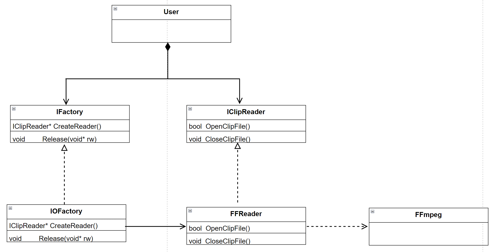
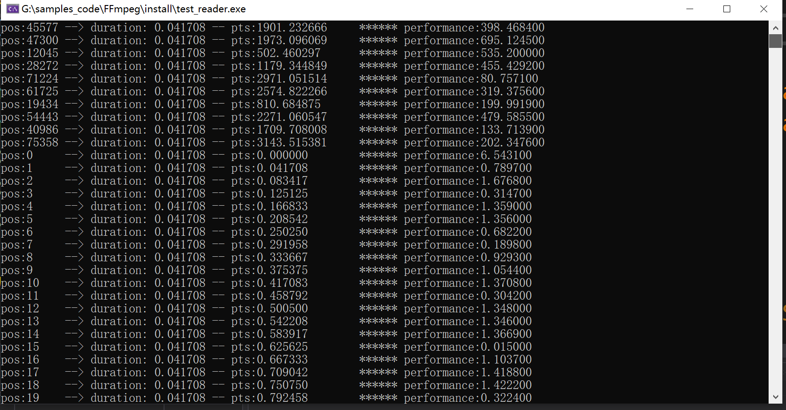

<center> <font face=red size=5> 基于ffmpeg封装一个音视频解码器 </font> </center>

[TOC]

&emsp;很久以前还在学校里面的时候, 当时计划改行搞软件行业, 自学了音视频方向。然后使用 ffmpeg 实现了个简单的播放器 Demo, 但是现在已经不忍直视当初的代码了。工作以后也没有专门从事编解码方向, 所以对 ffmpeg 的解码流程多少有些遗忘。前一段时间再玩 OpenGL 渲染各种基带解码的数据。但是获取各种 YUV 基带数据又比较麻烦。当时使用 ffmpeg 封装一个简单的 reader, 但是又不好集成到工程中。所以本文介绍使用 ffmpeg 封装一个获取音视频基带数据的动态库, 方便使用, 它可以获取总帧数内的任意帧号对应的基带数据。
&emsp;本文相关代码地址如下: [https://github.com/pengguoqing/samples_code/tree/master/FFmpeg](https://github.com/pengguoqing/samples_code/tree/master/FFmpeg )


#### 一、整体架构
&emsp; 这里直接贴出动态库中各个模块的 UML 类图:


调用者直接组合 __IFactory__ 和 __IClipReader__ 两个接口类即可创建一个素材音频或者视频解码器(__只支持解码一种流__)。
#### 二、素材参数定义
&emsp; 对于素材文件检测内部是否包含有音频或者视频流, 之后获取两者的基本参数, 比如宽高, 像素格式, 采样率。 目前还只支持获取素材编码原始的基带数据, 无法指定输出格式参数信息。素材参数的结构体定义如下：
```javascript
    struct ClipInfo {
        ClipInfo() = default;
        ~ClipInfo() = default;

        // video params
        bool m_hasvideo{false};
        bool m_hasaudio{false};
        int  m_width{0};
        int  m_height{0};
        int  m_gop_size{0};
        std::string m_vcodec_name;
        std::string m_pixfmt_name;
        float       m_frame_rate{0.f};

        // audio params
        int m_samplerate{0};
        int m_audio_depth{0};
        AudioFmt    m_samplefmt{AudioFmt::kAudioFmtUNKNOWN};
        std::string m_acodec_name;

        // ms duration
        uint64_t m_duration{0};

        // total frames
        uint64_t m_nb_frames{0};
    };
```
#### 三、解码数据缓存
&emsp; 在音视频编辑中 seek 的情况要远多余 play, 在用 OpenGL 渲染基带数据时有时也是着重渲染某一段的音视频, 而不是全部。所以缓存设计成根据帧号来获取对应的基带数据, 前文中提到的 __m_nb_frames__ 就是音视或者视频流的总帧数。采用 std::map 来记录帧号与对应基带数据之间的映射关系。如下所示:
```javascript
 std::map<uint64_t, std::shared_ptr<AVFrame>>	m_frame_cache;
 ```
&emsp; 取基带数据时的代码逻辑如下:
```javascript

        //不在帧号范围内
        if (pos >= m_mediainfo.m_nb_frames){
            return false;
        }
        
        //当前帧没有缓存, 需要seek
        if (pos<m_available_pos || pos > m_decode_pos) {
                SeekToFrameNum(pos);
                m_cache_condi.notify_one();
        }

        {
             const AVFrame* crrespond_frame{nullptr};
             std::unique_lock<std::mutex> cache_lock(m_cache_mux);

             if ( m_decode_pos == pos ) {      
                m_expect_new_frame.store(true, std::memory_order_relaxed);
                m_cache_condi.notify_one();
             }

             //等待目标帧解码并缓存
             std::map<uint64_t, std::shared_ptr<AVFrame>>::iterator dstframe;                    
             m_cache_condi.wait(cache_lock, [this, pos, &dstframe]{ dstframe = m_frame_cache.find(pos); return m_frame_cache.end() != dstframe ;});
             crrespond_frame = dstframe->second.get();       
           
             for(int i{0}; i < kMaxAVPlanes; i++){
                    frame->m_data[i]     = crrespond_frame->data[i];
                    frame->m_duration    = crrespond_frame->pkt_duration * av_q2d(m_curvalid_decode->m_stream->time_base);
                    frame->m_linesize[i] = crrespond_frame->linesize[i];
                    frame->m_pts         = av_q2d(m_curvalid_decode->m_stream->time_base) * crrespond_frame->pts;
                }
        }
       
        return true;
 ```
 &emsp;解码基带数据的代码逻辑如下:
```javascript
            //假如缓存池没有满, 就直接解码放进去
            //否则就需要等待并清理缓存的第一帧
            std::unique_lock<std::mutex> cache_lock(m_cache_mux);
            m_cache_condi.wait(cache_lock, [this] {return m_frame_cache.size() < m_maxche_size || m_expect_new_frame.load(std::memory_order_relaxed) || m_seek.load(std::memory_order_relaxed);});      
            if (m_frame_cache.size() < m_maxche_size) {
                std::shared_ptr<AVFrame> newframe{av_frame_alloc(), [](AVFrame* frame){av_frame_unref(frame); av_frame_free(&frame);}};
                av_frame_ref(newframe.get(), codec_frame);
                m_frame_cache.insert(std::pair<uint64_t, std::shared_ptr<AVFrame>>{m_decode_pos++, newframe});
            }else {
                auto first_node = m_frame_cache.begin();
                std::shared_ptr<AVFrame> frame = first_node->second;
                av_frame_unref(frame.get());
                m_frame_cache.erase(first_node);
                m_available_pos++;
                av_frame_move_ref(frame.get(), codec_frame);
                m_frame_cache.insert(std::pair<uint64_t, std::shared_ptr<AVFrame>>{m_decode_pos++, frame});
            }

            
            if (m_expect_new_frame.load(std::memory_order_relaxed)){
                m_expect_new_frame.store(false, std::memory_order_relaxed);
            }
 ```
#### 四、代码测试
&emsp; 动态加载 __ffrw__ 库, 先在总帧数内任意取 10 帧数据, 之后再从0 开始一次解码玩所有数据。测试代码如下:
```javascript
        string libpath{"ffrw.dll"};
	HMODULE h_moudle = LoadLibrary(libpath.c_str());
	if (nullptr != h_moudle){

		function<FactoryDeleter> factory_deleter = reinterpret_cast<FactoryDeleter*>(GetProcAddress(h_moudle, "ReleaeFactory"));
		function<FactoryCreater> factory_creater = reinterpret_cast<FactoryCreater*>(GetProcAddress(h_moudle, "CreateMediaIOFactory"));
		mediaio::IFactory* factory =  factory_creater();
		mediaio::IClipReader* clip_reader = factory->CreateReader();
		mediaio::ClipInfo media_info;

		string filepath{ "01.mp4" };
		if (clip_reader->OpenClipFile(filepath, mediaio::SoureType::kSourceTypeV)) {
			mediaio::ClipInfo media_info = clip_reader->GetClipInfo();
			mediaio::AVSoucreData videoframe;
			
			//radom get 10 frames
			for (uint64_t i{0}; i<10; i++){
				std::random_device rd;  
				std::mt19937 gen(rd());
				uniform_int_distribution<> distrib(0, media_info.m_nb_frames - 1);
				uint64_t pos = distrib(gen);

				chrono::high_resolution_clock::time_point begin = chrono::high_resolution_clock::now();
				clip_reader->GetSourceData(pos, &videoframe);
				chrono::high_resolution_clock::time_point end = chrono::high_resolution_clock::now();
				chrono::duration<double, milli> duration_ms = end- begin;
				
				cout << "pos:" << left << setw(6) << pos << "--> duration: " << left << setw(8) << fixed << std::setprecision(6) << videoframe.m_duration << " -- pts:" << left << setw(16) << videoframe.m_pts << "****** performance:"<< fixed << std::setprecision(6) << duration_ms.count() <<endl;
			}
			this_thread::sleep_for(chrono::seconds(3));
			for (uint64_t i{0}; i<media_info.m_nb_frames; i++)
			{
				chrono::high_resolution_clock::time_point begin = chrono::high_resolution_clock::now();
				clip_reader->GetSourceData(i, &videoframe);
				chrono::high_resolution_clock::time_point end = chrono::high_resolution_clock::now();
				chrono::duration<double, milli> duration_ms = end - begin;

				cout << "pos:" << left << setw(6) << i << "--> duration: " << left << setw(8) << fixed << std::setprecision(6) << videoframe.m_duration << " -- pts:" << left << setw(16) << videoframe.m_pts << "****** performance:" << fixed << std::setprecision(6) << duration_ms.count()<< endl;
			}

		}

		clip_reader->CloseClipFile();

		factory->Release(clip_reader);
		factory_deleter(factory);
 ```

 测试结果如下:
 
 总结：随机帧号的解码效率低, 连续解码的效率高。逻辑上也正确, 毕竟随机解码要清理缓存, 然后 seek 文件, 解码关键帧后再解码相关帧, 直至解码目标帧成功。