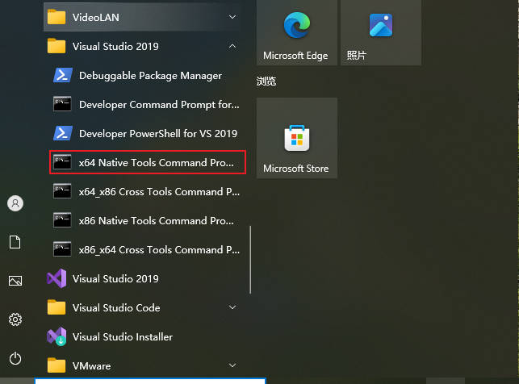
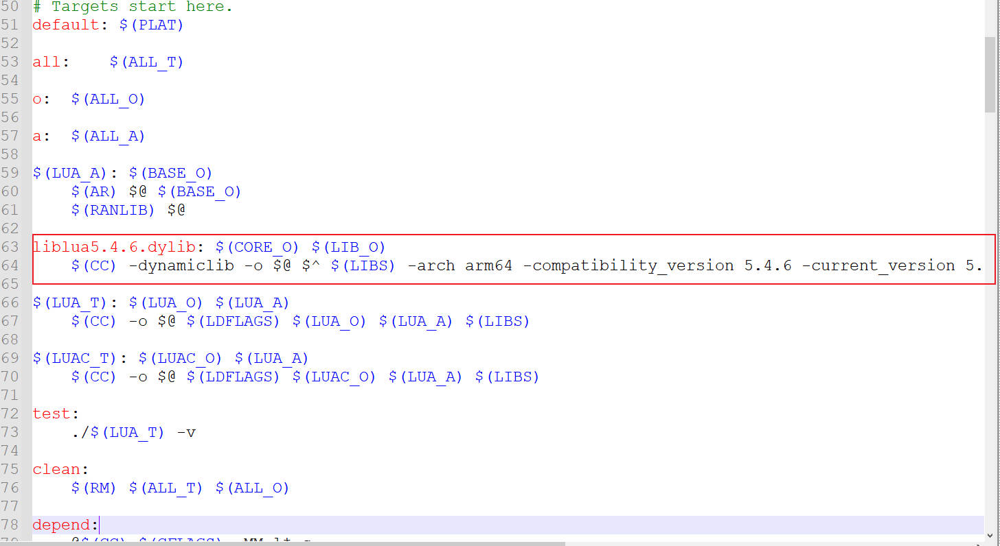

<center> <font face=red size=5> lua在不同平台下的编译 </font> </center>

[TOC]

&emsp; 本文介绍一下lua在 windows, Mac, Linux 三个平台下使用源码编译动态库的过程。

#### 一、前言
&emsp; 官网只提供了 Makefile 工程, 这个可以直接在linux和 Mac 平台进行编译,但是编译目标是静态库,不方便使用。Windows 平台假如要编译 Makefile 工程,则需要安装 MSYS2 环境,这里直接使用 Visual Studio的 cl.exe 编译器。
首先在官网下载 lua 源码文, [h https://www.lua.org/download.html]( https://www.lua.org/download.html)

#### 二、windwos平台编译 lua 动态库
 &emsp; windows平台默认安装了 VS2017、VS2019、VS2022等开发环境之一。直接在开始菜单栏 VS 目录下找到 x64 Native Tools Command Prompt for VS 2019  然后打开。
 如果要编译 32 位的库,打开 x86 对应的CMD即可。如下图所示:
 
 在 x64 Native Tools Command Prompt for VS 2019 CMD中切换到 lua 源码文件的 src 目录下。
```shell
 cd D:\project_code\lua\lua-5.4.7\src
 cl /MD /O2 /c /DLUA_BUILD_AS_DLL ./*.c
```
或者直接指定源码所在目录
```shell
 cl /MD /O2 /c /DLUA_BUILD_AS_DLL D:\project_code\lua\lua-5.4.7\src\*.c
``` 
然后依次输入一下命名进行编译
```javascript
 ren  lua.obj lua.o
 ren  luac.obj luac.o
 link /DLL /IMPLIB:lua5.4.7.lib /OUT:lua5.4.7.dll *.obj
 link /OUT:lua.exe lua.o lua5.4.7.lib
 lib  /OUT:lua5.4.7-static.lib *.obj
 link /OUT:luac.exe luac.o lua5.4.7-static.lib
```
这样一来lua的动态库和静态库都编译好了, 编译结果就在 src 目录。


#### 三、Linux平台编译 lua 动态库
&emsp;Linux平台的编译就相对简单一些了,毕竟系统原生支持 Makefile。直接在 Makefile 工程添加一行编译动态的脚本即可。注意修改的是 **src/Makefile** 文件, 运行的则是 src 目录同级的 Makefile  
```shell
 $(CC) -shared -ldl -Wl,-soname,liblua$R.so -o liblua$R.so $? -lm $(MYLDFLAGS)
```
 添加位置如下图所示:


 然后执行 Make 命令如下:
 ```shell
 make "MYCFLAGS=-fPIC" "R=5.4.6"
 ```
 如果编译的不是 **lua5.4.6** 版本,那么将 **R** 替换为对应版本即可。	
	
#### 四、Mac平台编译 lua 动态
&emsp;与 Linux 平台的编译类似, 需要修改 src/Makefile 文件, 在文件中添加构建动态库的命令。
```shel 
  liblua5.4.6.dylib: $(CORE_O) $(LIB_O)
	$(CC) -dynamiclib -o $@ $^ $(LIBS) -arch arm64 -compatibility_version 5.4.6 -current_version 5.4.6 -install_name @rpath/$@
```
如下图所示:	
	
	
再使用如下命令执行与 src 目录同级的 Makefile 脚本。
```shel   
  make -C ./src liblua5.4.6.dylib
```  
至此编译成功。