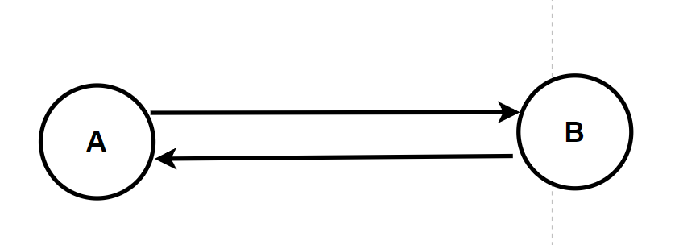

<center> <font face=red size=5> shared_ptr智能指针注意事项 </font> </center>

[TOC]
&emsp; 本文记录几个 shared_ptr 智能指针使用时的注意事。

#### 一、AB对象互相引用的问题
&emsp; B对象互相引用的问题, 从我开始学习智能指针的时候就知道它,感觉这个问题很出名, unique_ptr 内部因为没有引用计数的结构, 所以不存在这个问题。现在几乎每本讲到智能指针的书都会讲到这个问题, 有点像多线程开发中的 AB 锁现象。但是它又不像 AB 所那样复现后容易排查出原因, 所以需要在开发中注意有这个意识。形成的原因示意图如下:

测试代码如下：
```javascript

struct BClass;

struct AClass
{
	shared_ptr<BClass> pb;
	~AClass() { std::cout << "~AClass()\n"; }
};

struct BClass
{
	shared_ptr <AClass> pa;
	~BClass() { std::cout << "~BClass()\n"; }
};

int main()
{
	{
		auto a = std::make_shared<AClass>();
		auto b = std::make_shared<BClass>();
		//ref a= 1;
		//ref b= 1;
		 
		// 循环引用
		a->pb = b;
		b->pa = a;
		
		//ref a= 2;
		//ref b= 2;
		std::cout << "计数: " << a.use_count() << "\n";
		std::cout << "计数: " << b.use_count() << "\n";

	}

    // a, b 仍然相互持有, 引用计数都为 1
	return 0;
```
直至程序退出时堆上的 AB对象才会析构, 在跳出作用域直至程序退出的时间段内就会内存泄漏。
更复杂的情况是三者之间相互引用,形成环状引用, 一种情况如下所示:


此时代码示意如下:
```javascript
struct BClass;

struct AClass
{
	shared_ptr<BClass> pb;
	~AClass() { std::cout << "~AClass()\n"; }
};

struct CClass;

struct BClass
{
	shared_ptr<CClass> pc;
	~BClass() { std::cout << "~BClass()\n"; }
};

struct CClass
{
	shared_ptr<AClass> pa;
	~CClass() { std::cout << "~CClass()\n"; }
};

int main()
{
	{
		auto a = std::make_shared<AClass>();
		auto b = std::make_shared<BClass>();
		auto c = std::make_shared<CClass>();

		// 循环引用
		a->pb = b;
		b->pc = c;
		c->pa = a;

		//ref a= 2;
		//ref b= 2;
		//ref c= 2;
		std::cout << "计数: " << a.use_count() << "\n";
		std::cout << "计数: " << b.use_count() << "\n";
		std::cout << "计数: " << c.use_count() << "\n";
	}


	// a, b c 仍然相互持有
	return 0;
}
```
解决方案就是引入弱引用智能指针, 只要能让其中一个智能指针对象析构内部的引用计数为0, 其余对象就会随之析构。结局方案就是让 __A__, __B__, __C__ 三个对象之一或者多个内部的shared_ptr替换为 __weak_ptr__。假如讲__A__对象内部替换为 __weak_ptr__, 那么析构顺序为 __B__, __C__, __A__


#### 二、 返回 this 指针问题
&emsp;考虑如下代码：
```javascript
class Widget {

public:
	weak_ptr<Widget> weak_w;

	Widget()
	{
		cout << "Widget()" << endl;
	}


	shared_ptr<Widget> getWidget() {
			return shared_ptr<Widget>(this); 
	}

	~Widget()
	{
		cout << "~Widget()" << endl;
	}

};
int main() {

	shared_ptr<Widget> sw1;
	{
		Widget* pw = new Widget();
		
		shared_ptr<Widget> sw2 = pw->getWidget();

		delete pw;
	}
}
```
此时运行会报错, 报错的原因是出现了 __double delete__。 sw2智能指针和 pw 的申请者都会释放同一块内存, 于是程序就 crash 了。 在某些时候又需要返回或者传递 __this__ 指针, 比如：
```javascript

void process(const std::shared_ptr<Widget> tp);

class Widget {

public:
    weak_ptr<Widget> weak_w;

    Widget()
    {
        cout<<"Widget()"<<endl;
    }


    shared_ptr<Widget> getWidget() {

        return shared_ptr<Widget>(this); 
    }

    void invoke(){
        process(shared_ptr<Widget>(this));
    }

    void print(){
        cout<<"print"<<endl;
    }

    ~Widget()
    {
        cout<<"~Widget()"<<endl;
    }
 
};
```
这个时候一样会出现 __double delete__ 的问题。为此标准库专门引入了 __enable_shared_from_this__。它有以下规范:

__a,需要传递或者返回 this 指针的类需要首先继承 enable_shared_from_this, 然后通过 shared_from_this() 函数返回管理 this 的 shared_ptr 对象(相当于引用计数增加)__
__b,只能通过 shared_ptr 智能指针返回 this, 不可用普通栈对象或者裸指针 返回this__
所以一个需要被传递 __this__ 的类对象的合理设计如下:
```javascript  
//1. 必须公有继承，确保Widget可转型为enable_shared_from_this
//2. 必须使用Shared指针，调用 shared_from_this()
//   安全做法：将构造函数private禁止创建栈对象、使用静态工厂函数确保创建shared指针
class Widget : public std::enable_shared_from_this<Widget> {
public:
    
    std::shared_ptr<Widget> getWidget() {

         return shared_from_this(); 
        
    }

    void invoke(){
        process(shared_from_this());
        //process(shared_ptr<Widget>(this));错误！
    }


    void print(){
        cout<<"print"<<endl;
    }

    ~Widget()
    {
        cout<<"~Widget()"<<endl;
    }

    //工厂函数
    static std::shared_ptr<Widget> create() {
        return std::shared_ptr<Widget>(new Widget());
    }

private:
    Widget()=default;
};

void process(const std::shared_ptr<Widget> tp)
{
    tp->print();
    cout<<"ref count: "<<tp.use_count()<<endl;
    cout<<"process--------"<<endl;
}

int main()
{
    {
         shared_ptr<Widget> sp1=Widget::create();
 
         auto sp2=sp1->getWidget();
         cout<<"ref count: "<<sp1.use_count()<<endl;
         cout<<"ref count: "<<sp2.use_count()<<endl;
         cout<< sizeof(Widget)<<endl;
    }
}
```
它的大概原理是在基类 __std::enable_shared_from_this__ 中有一个 __weak_ptr__ 的成员变量, __shared_ptr__ 在构造的时候会首先检查类对象是否共有继承自  __std::enable_shared_from_this__, 假如是则通过类型转换把 __std::enable_shared_from_this__中的 __weak_ptr__ 指向当前构造的 __shared_ptr__。后续的 __shared_from_this()__ 函数内部就相当于 
```javascript 
 if(!weak_w.expired()){
    return weak_w.lock();
 }
            
```

#### 三、可能存在的内存泄漏
&emsp;这个问题也很奇葩, 我刚开始使用智能指针的时候感觉使用了 __RAII__管理资源那岂不是相当靠谱,咋会存在内存泄漏的问题呢。可是实践终究是说服了我。考虑如下代码:
```javascript 
class MyClass {

public:
	MyClass() { cout << "MyClass()" << endl; }
	~MyClass() { cout << "~MyClass()" << endl; }


private:
	double x, y, z;
};


int alloc_times = 0;
int dealloc_times = 0;
int allocated = 0;


void* operator new(size_t size) {
	void* p = std::malloc(size);
	cout << "new " << size << " byte(s)" << endl;

	allocated += size;
	alloc_times++;
	return p;
}

void operator delete(void* p) noexcept {
	cout << "deleted memory" << endl;

	dealloc_times++;
	return std::free(p);
}


int main() {

	weak_ptr<MyClass> w;
	cout << "分配尺寸:" << allocated << endl;
	cout << "分配次数" << alloc_times << endl;
	cout << "释放次数" << dealloc_times << endl;
	{
		shared_ptr<MyClass> s{new MyClass()};
		w=s; 

	}   //1. s析构、释放原始对象、但不释放控制块
	cout << "block end--------" << endl;
	cout << "分配尺寸:" << allocated << endl;
	cout << "分配次数" << alloc_times << endl;
	cout << "释放次数" << dealloc_times << endl;
}           
```
此时输出如下：

实际情况是类对象被析构, 在堆上对应的内存块也被释放, 但是智能指针内部的控制块内存会被 __weak_ptr__ 拽住, 直至进程结束才会释放。需要手动释放才可以:
```javascript 
int main() {

	weak_ptr<MyClass> w;
	cout << "分配尺寸:" << allocated << endl;
	cout << "分配次数" << alloc_times << endl;
	cout << "释放次数" << dealloc_times << endl;
	{
		shared_ptr<MyClass> s{new MyClass()};
		w=s; 

	} 
    w.reset(); //2. w析构、释放控制块 
	cout << "block end--------" << endl;
	cout << "分配尺寸:" << allocated << endl;
	cout << "分配次数" << alloc_times << endl;
	cout << "释放次数" << dealloc_times << endl;
}                 
```
这一点在使用 __make_shared__ 构造智能指针时就更明显, 因为它会使用 __placement_new__ 进行优化, 把控制块内存和堆对象内存放在一块内存上进行管理, 此时假如不手动释放 __weak_ptr__, 那么就只会有对象的析构被调用, 内存会和 控制块内存一起被拽住。