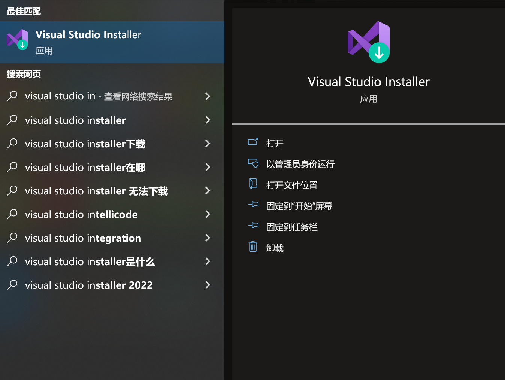
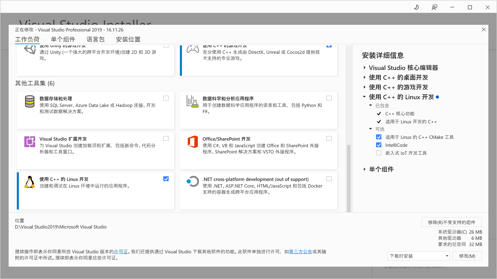
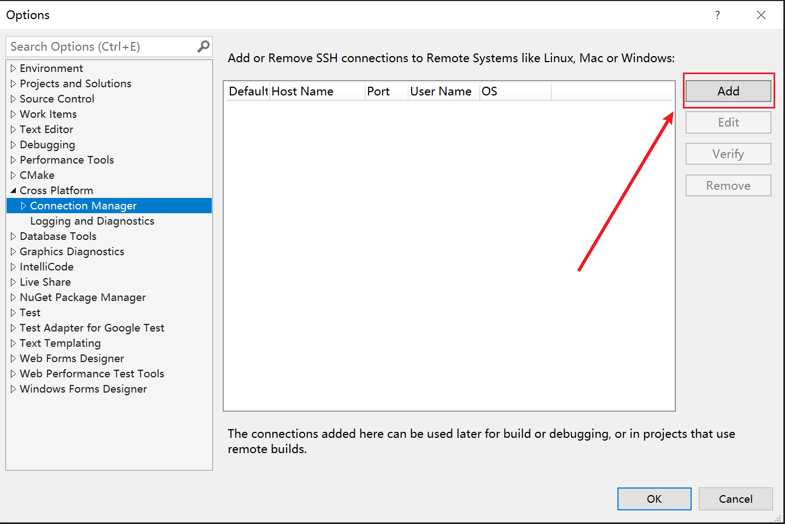
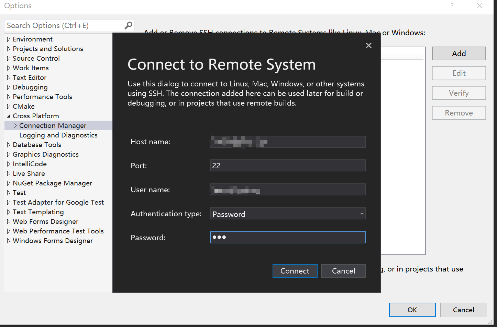
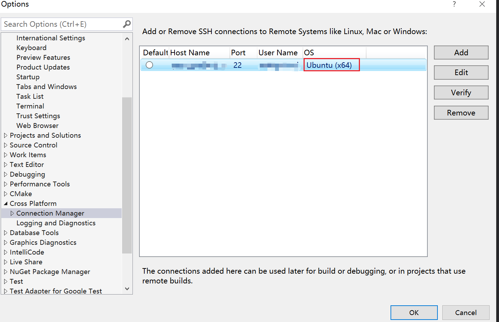
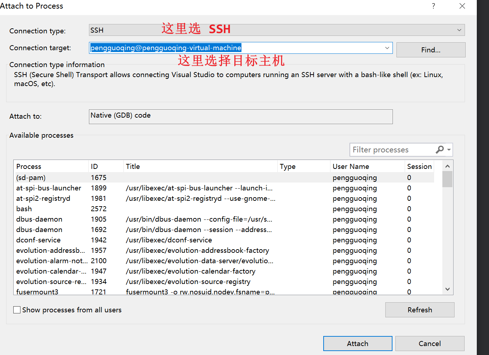
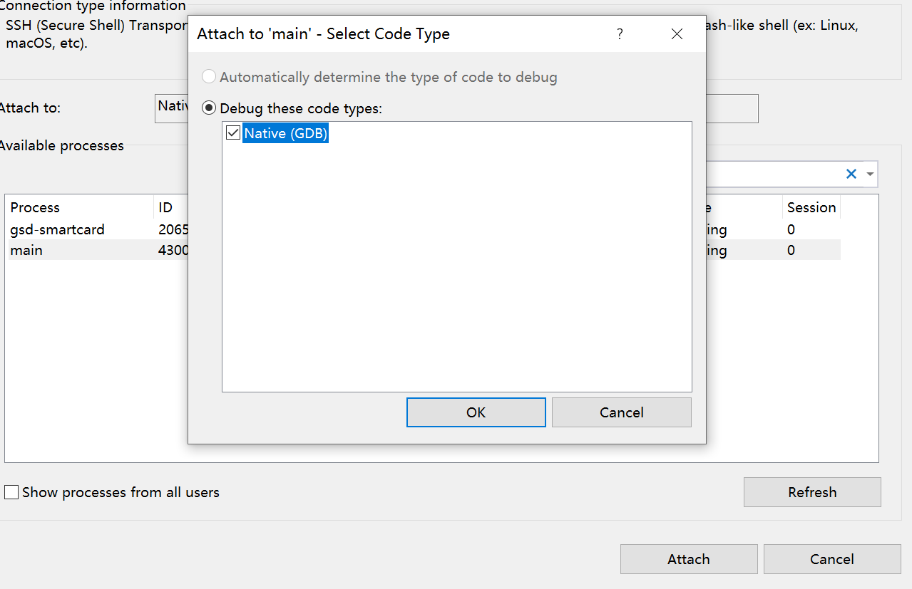

<center> <font face=red size=5> VS2019远程调试 Linux 进程 </font> </center>

[TOC]

&emsp;之前都是在 windows 下编写代码并调试, 习惯了 IDE 的调试环境。后来需要开发跨平台的程序就不得不用上了 GDB 和 LLDB 来调试, 当时感觉非常不适应, 但是逐渐还是需要学会了较多的 GDB 常用的命令, 一般情况下还是能玩起来。最近在闲逛的时候发现 VS2019 已经可以远程调试 linux 系统系统下的进程了, 感觉相当牛逼, 试了一下真的可以。本文就记录一下 VS2019 远程调试 Linux 进程的环境搭建。

参考文章: [https://learn.microsoft.com/zh-cn/cpp/linux/connect-to-your-remote-linux-computer?view=msvc-170](https://learn.microsoft.com/zh-cn/cpp/linux/connect-to-your-remote-linux-computer?view=msvc-170)

#### 一、Linux系统环境准备
&emsp; linux 机器需要安装 gdb, make, ssh-server, g++,当然相信大多数用户已经安装了,这里还是把安装命令贴出来一下:
 ```shell
 sudo apt install openssh-server g++ gdb make
 ```
 &emsp;安装好后需要开启 SSH 服务：
  ```shell
sudo service ssh start
 ```
 &emsp;当然 SSH 服务开机自启动的的话执行下面的命令：
   ```shell
sudo systemctl enable ssh
 ```
 至此, Linux 系统上的环境就准备好了, 后面直接启动运行相关的进行就可以了。这里先写一个简单的 cmake 工程.

#### 二、VS2019环境准备
##### 2.1、插件安装
&emsp;这里假设大家都是通过 [vs installer](https://visualstudio.microsoft.com/downloads/) 安装的 VS2019. 所以这里搜索打开即可, 如下图所示:

安装 __使用 C++ 的 Linux 开发__ 插件, 如下图所示:


安装好后就可以开始设置远程连接目标了。

##### 2.2、添加目标机器
&emsp;打开 VS2019 后, 依次通过 __Tools__ -> __Options__ -> __Cross Platform__ 打开对话框, 如下图所示：

点击 __Add__ 按钮设置目标机器信息:

输入目标机器的地址, 用户名和密码即可, 其余两项就用默认参数即可。连接好后能识别出主机操作系统的类型,如下图所示。


#### 三、远程调试
&emsp;将工程代码拷贝到 windows 系统中, 使用 VS2019直接打开文件夹。当然也可以构建VS的工程再打开。
通过 __Debug__ -> __Attach Process__ 添加进程如下图所示:

之后选择指定的进程即可。本文使用一个名为 __main__的测试程序。


假如出现 __Attaching to a process on Linux with GDB as a normal user may fail with "ptrace:Operation not permitted".__ 的错误提示, 则在 linux下执行一下命令:
```shell
echo 0| sudo tee /proc/sys/kernel/yama/ptrace_scope

#或者
sudo setcap cap_sys_ptrace=eip /usr/bin/gdb
 ```